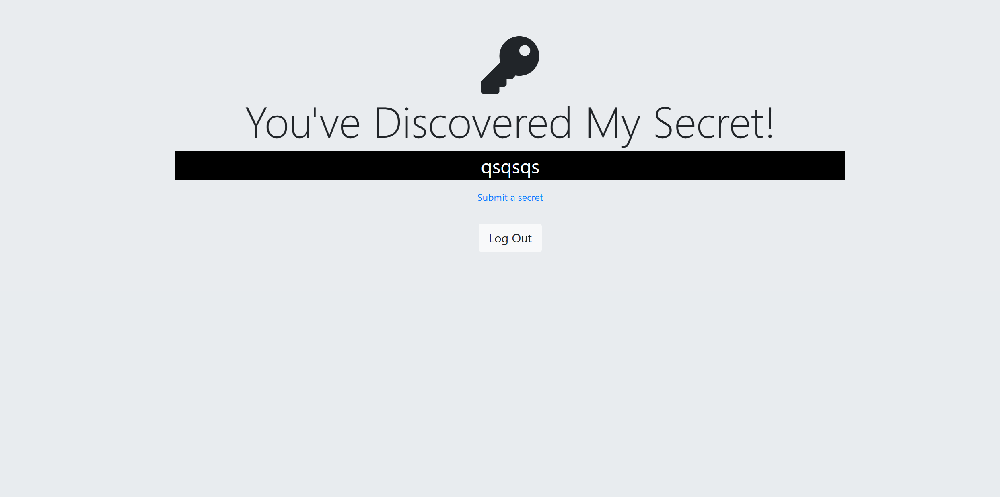

# Secrets

[]()

A web application for anonymous secret sharing. Users can register, authenticate via email/password or Google OAuth, and share their secrets anonymously. The app provides a secure platform for users to express themselves freely while maintaining privacy and security.

## ✨ Features

- **User Authentication:** Secure registration and login with email/password.
- **Google OAuth Integration:** One-click authentication using Google accounts.
- **Anonymous Secret Sharing:** Share secrets without revealing your identity.
- **Secure Password Hashing:** Passwords are encrypted using bcrypt.
- **Session Management:** Persistent login sessions with Express sessions.
- **Responsive Design:** Works on desktop and mobile devices.
- **PostgreSQL Database:** Persistent storage for all user data and secrets.

## 🛠️ Technologies Used

- **Backend:**
  - Node.js
  - Express
  - PostgreSQL
  - Passport.js (authentication)
  - bcrypt (password hashing)
- **Frontend:**
  - EJS (templates)
  - HTML/CSS
  - JavaScript
  - Bootstrap 4
- **Authentication:**
  - Passport Local Strategy
  - Passport Google OAuth2 Strategy
- **Database:**
  - PostgreSQL
- **Other:**
  - Express sessions
  - dotenv (environment variables)
  - Git for version control

## 🚀 Installation

1. **Clone the repository:**

   ```bash
   git clone https://github.com/Antoinekoe/login-clients.git
   cd secrets-app
   ```

2. **Install dependencies:**

   ```bash
   npm install
   ```

3. **Set up your PostgreSQL database:**

   - Create a database named `secrets`.
   - Create a table named `users` with the following structure:
     ```sql
     CREATE TABLE users (
       id SERIAL PRIMARY KEY,
       email VARCHAR(100) UNIQUE NOT NULL,
       password VARCHAR(100) NOT NULL,
       secret VARCHAR(255),
     );
     ```

4. **Set up environment variables:**

   - Create a `.env` file in the root directory:
     ```env
     SESSION_SECRET=your_session_secret_here
     PG_USER=your_postgres_username
     PG_HOST=localhost
     PG_DATABASE=secrets_db
     PG_PASSWORD=your_postgres_password
     PG_PORT=5432
     GOOGLE_CLIENT_ID=your_google_client_id
     GOOGLE_CLIENT_SECRET=your_google_client_secret
     ```

5. **Configure Google OAuth (Optional):**

   - Go to [Google Cloud Console](https://console.cloud.google.com/)
   - Create a new project or select an existing one
   - Enable the Google+ API
   - Create OAuth 2.0 credentials
   - Add `http://localhost:3000/auth/google/secrets` to authorized redirect URIs
   - Update your `.env` file with the client ID and secret

6. **Start the server:**

   ```bash
   nodemon index.js
   ```

   The app will be available at `http://localhost:3000`.

## 📁 Project Structure

```
Secrets/
├── public/               # Static files (CSS, images, etc.)
│   └── css/              # CSS stylesheets
│       └── styles.css    # Main stylesheet
├── views/                # EJS templates
│   ├── partials/         # Reusable template components
│   │   ├── header.ejs    # Header template
│   │   └── footer.ejs    # Footer template
│   ├── home.ejs          # Home page
│   ├── login.ejs         # Login page
│   ├── register.ejs      # Registration page
│   ├── secrets.ejs       # Secrets display page
│   └── submit.ejs        # Secret submission page
├── partials/             # Additional partials (if needed)
├── css/                  # Additional CSS files
├── index.js              # Main server file
├── package.json          # npm config file
├── package-lock.json     # npm lock file
├── .env                  # Environment variables (create this)
├── screenshot-git.png    # Project screenshot
└── README.md             # This file
```

## 🔐 How to Use

1. **Home Page:** Visit the home page to see the welcome message and navigation options.
2. **Registration:** Create an account using email/password or sign up with Google.
3. **Login:** Access your account using your credentials or Google OAuth.
4. **Submit Secrets:** Once logged in, you can submit your anonymous secrets.
5. **View Secrets:** See your submitted secrets on the secrets page.
6. **Logout:** Securely log out when you're done.

## 🔒 Security Features

- **Password Hashing:** All passwords are encrypted using bcrypt with salt rounds.
- **Session Security:** Secure session management with environment-based secrets.
- **OAuth Integration:** Secure Google authentication without storing passwords.
- **SQL Injection Prevention:** Parameterized queries for all database operations.
- **Input Validation:** Server-side validation for all user inputs.

## 🤝 How to Contribute

Contributions are welcome!

1. **Fork the repository.**
2. **Create a branch for your feature or fix:**
   ```bash
   git checkout -b feature/my-new-feature
   # or
   git checkout -b bugfix/bug-fix
   ```
3. **Make your changes and commit with a clear message.**
4. **Push your branch to your fork:**
   ```bash
   git push origin feature/my-new-feature
   ```
5. **Create a pull request to the `main` branch of the original repository.**

## 🔧 Potential Improvements (TODO)

- Add user profiles with customizable avatars.
- Implement secret categories and tags.
- Add a public secrets feed (with user consent).
- Create a voting system for secrets.
- Add comment functionality for secrets.
- Implement secret sharing via social media.
- Add email verification for new accounts.
- Create an admin panel for moderation.
- Add secret expiration dates.
- Implement a reporting system for inappropriate content.
- Add dark mode theme.
- Create a mobile app version.
- Add push notifications for new features.
- Implement secret analytics and insights.

## 🔑 License

This project is licensed under the MIT License - see the [LICENSE](LICENSE) file for details.
